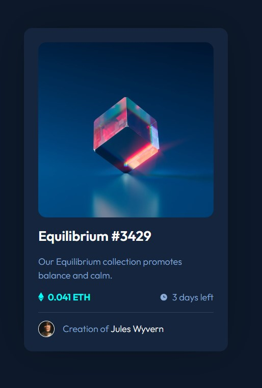

# Frontend Mentor - NFT preview card component solution

This is a solution to the [NFT preview card component challenge on Frontend Mentor](https://www.frontendmentor.io/challenges/nft-preview-card-component-SbdUL_w0U). Frontend Mentor challenges help you improve your coding skills by building realistic projects.

## Table of contents

- [Overview](#overview)
  - [The challenge](#the-challenge)
  - [Screenshot](#screenshot)
  - [Links](#links)
- [My process](#my-process)
  - [Built with](#built-with)
  - [What I learned](#what-i-learned)
  - [Continued development](#continued-development)
- [Author](#author)

## Overview

### The challenge

Users should be able to:

- View the optimal layout depending on their device's screen size
- See hover states for interactive elements

### Screenshot

### Links

- Solution URL: [Github](https://github.com/VimDiesel123/nft-preview-card-component-main)
- Live Site URL: [Netlify](https://idyllic-semifreddo-372645.netlify.app/)

## My process

### Built with

- Semantic HTML5 markup
- CSS custom properties
- Flexbox
- Mobile-first workflow

### What I learned

I got some pratice with CSS fundamentals, I think I'm getting better at structuring my CSS and HTML and making more use of the cascade.

### Continued development

Spacing and Layout are still things I need more practice with. I think grid might have been a better choice for the main layout in this one, but I used flexbox because it was more familiar. I need to learn grid.

## Author

- Website - [David Smith](https://www.dsmithdevcom)
- Frontend Mentor - [@VimDiesel123](https://www.frontendmentor.io/profile/VimDiesel123)
